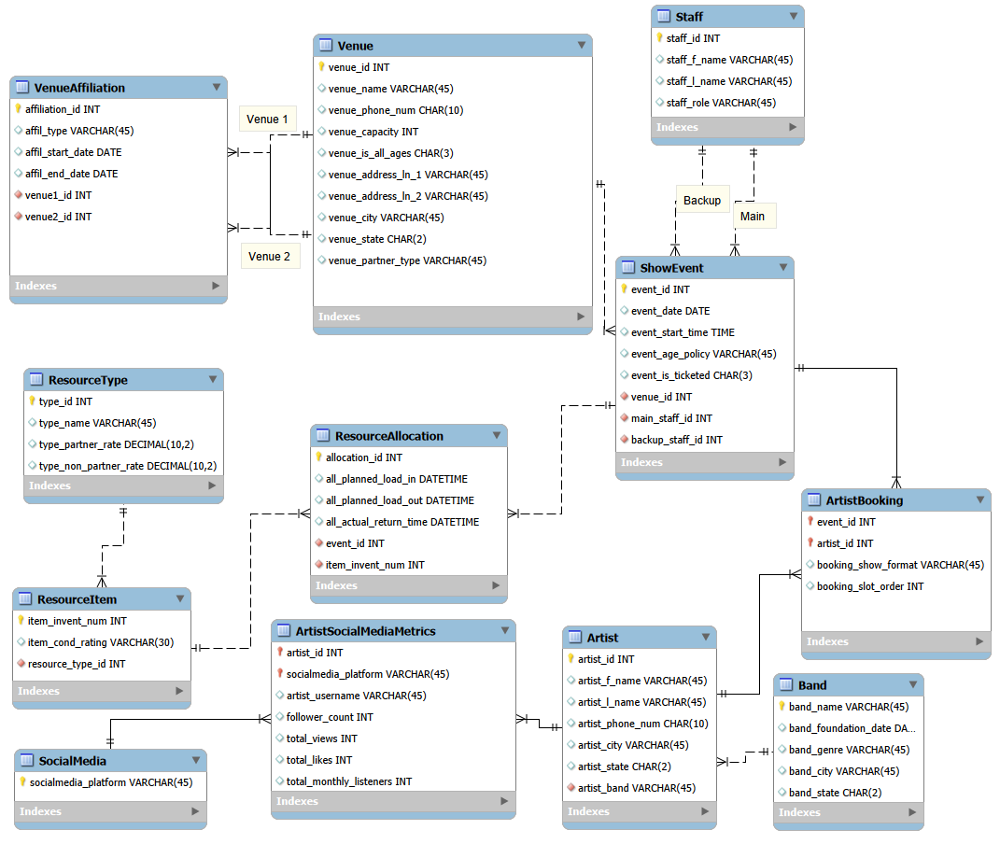

# MIST-4610-Project

**Team Name:**
Group B4

**Group Member Names:**
Zeynep Koseoglu (Conceptual Modeler), Mark Monzer (Database Designer), Morgan Matherne (Group Lead), Roshan Gadiraju (SQL Writer), Hiya Shah (Data Wrangler)

**Case Description**
LMC is an organization that organizes many music events in Athens. It partners with artists and venues to plan shows and manage events. They keep track of significant information regarding venues. This could be location, venue capacity, and the status of partnership with venues. It can also store data regarding artists' contact information or where they’re based. Each event represents a unique performance, venue, and time. Events can have many artists. For example, an opener and headliner, and all artists are given a unique performance order. All events are managed by a head/main staff member, alongside a backup staff member. Additionally, LMC handles equipment like sound and lighting systems, which are appropriately distributed as needed. These resources are tracked closely to ensure no double bookings. LMC also tracks partnerships and agreements for shared equipment. To make the system more efficient, we added a band and social media extension. Artists can be connected to bands, allowing the system to represent groups and solo artists. We also added social media tracking. This allows each artist to have data such as followers, likes, views and monthly listeners across many platforms. These extensions aid LMC in making better decisions when planning events and booking artists. An example would be choosing more popular artists for larger venues or more fitting time slots. Overall, the system LMC uses data to improve its business as opposed to just managing events.

**Data Model**

## Data Dictionary
[Download the Data Dictionary](Data_Dictionary.docx)

# Queries

**Query #1**

Identify all "All-Ages" Venues in Athens
Question: Which venues in Athens allow all-ages attendance, and what are their capacities and addresses?
Justification: It lets booking agents pick places suited for younger crowds, matching the audience an artist draws. Venue fit matters when age groups differ. That way, shows land where fans actually go.

SELECT venue_name, venue_capacity, venue_address_ln_1, venue_address_ln_2 
FROM mb_B4.Venue
WHERE venue_is_all_ages = FALSE AND venue_address_ln_2 LIKE 'Suite 100';

**Query #2**

List all Bands within a specific Genre
Question: Can we see a list of all bands categorized as ‘Hip-Hop’ and where they are from?
Justification: Organizers can rely on this during festivals to sort acts by sound, especially when setting up dedicated rap events across collaborating spots. What matters is how it helps shape each night’s lineup without confusion spreading behind the scenes.

SELECT Band_Name, Band_City 
FROM mb_B4.Band
WHERE Band_Genre = 'Hip-Hop'
ORDER BY Band_Name;

**Query #3**

Retrieve all Resource Items with a "Fair" Condition
Question: Which equipment items are currently in "Fair" condition?
Justification: Equipment shows signs of aging, the crew can decide what needs fixing or swapping out first. This helps avoid breakdowns when performances are happening. Spotting issues early means problems won’t interrupt a show. When parts start wearing down, they get attention before things go wrong. That way, everything runs smoother on event nights.

SELECT item_invent_num, item_cond_rating 
FROM mb_B4.ResourceItem
WHERE item_cond_rating = 'Fair';

**Query #4**

Find Artist contact info for those based in Athens
Question: What are the names and phone numbers of all artists based in Athens?
Justification: A handy list of nearby performers lets organizers act fast when spots open up unexpectedly. This setup cuts down on travel expenses while making it easier to pull together community-based shows at short notice.

SELECT artist_f_name, artist_l_name, artist_phone_num 
FROM mb_B4.Artist
WHERE artist_city = 'Athens';

**Query #5**

Calculate Potential Rental Revenue based on Venue Partner Type
Question: What is the total potential rental revenue for each venue, accounting for different rates for Partners vs. Non-Partners?
Justification: It shows how each location is doing financially, managers can see whether offering discounts through partners brings enough extra business to make up for lower prices. What matters here is spotting trends across sites where deals might be helping - or hurting - overall results. When one spot gives more breaks but sells way more tickets, that pattern could signal success. Yet another place might cut prices just a bit yet stay flat, raising questions about what drives growth. Seeing these differences clearly helps leaders adjust without guessing.

SELECT venue_name, 
SUM(CASE WHEN Venue.venue_partner_type = 'Partner' THEN ResourceType.type_partner_rate ELSE ResourceType.type_non_partner_rate END) 
AS Total_Billing 
FROM Venue 
JOIN ShowEvent ON Venue.venue_id = ShowEvent.venue_id 
JOIN ResourceAllocation ON ShowEvent.event_id = ResourceAllocation.event_id 
JOIN ResourceItem ON ResourceAllocation.item_invent_num = ResourceItem.item_invent_num 
JOIN ResourceType ON ResourceItem.Resource_type_id = ResourceType.type_id 
GROUP BY venue_name;

**Query #6**

Identify "Power Artists" (Booked for more than 2 shows)
Question: Which artists have been booked for more than two shows across the circuit?
Justification: Who pulls big crowds and delivers steady income? These top performers often get first pick on dates or deals covering several shows. Some find their calendar fills fast - consistency pays off.

SELECT artist_f_name, artist_l_name, 
COUNT(ArtistBooking.booking_show_format) AS Total_Bookings 
FROM mb_B4.Artist 
JOIN ArtistBooking ON Artist.artist_id = ArtistBooking.artist_id 
GROUP BY Artist.artist_id 
HAVING COUNT(ArtistBooking.booking_show_format) > 2;

**Query #7**

Find Resource Types that have NEVER been used
Question: Which resource types have never been used in a show allocation?
Justification: Dead stock shows up clearly, managers might choose to sell off old gear. Or they could group it with popular items so event spaces are more likely to book them. Seeing what sits too long helps shape those choices.

SELECT type_name 
FROM mb_B4.ResourceType 
WHERE NOT EXISTS ( SELECT 1 FROM ResourceItem 
JOIN ResourceAllocation ON ResourceItem.item_invent_num = ResourceAllocation.item_invent_num 
WHERE ResourceItem.resource_type_id = ResourceType.type_id );

**Query #8**

Staff Workload: Primary vs. Backup Roles
Question: What is the total distribution of Primary and Backup coordinator roles across all staff members?
Justification: Balancing tasks matters so one person does not end up carrying too much weight. Team flow stays smoother when responsibility shifts around naturally. Work spreads out better if no individual gets stuck leading every time. Even pressure helps keep energy steady across roles. Shared effort means fewer breakdowns during busy periods.

SELECT staff_f_name, staff_l_name, 'Primary' AS Role 
FROM mb_B4.Staff 
JOIN ShowEvent ON Staff.staff_id = ShowEvent.main_staff_id 
UNION SELECT staff_f_name, staff_l_name,'Backup' AS Role 
FROM Staff 
JOIN ShowEvent ON Staff.staff_id = ShowEvent.backup_staff_id;

**Query #9:**

Identify Social Media Engagement vs. Performance
Question: How does an artist's monthly listener count correlate with their actual number of bookings?
Justification: It shows which artists are gaining fast on social media, even if they’re not playing many gigs yet. Scouts spot these names before others catch on. Popularity online sometimes means big crowds later. A quiet artist today might sell out tomorrow. Numbers help tell that story early.

SELECT artist_f_name, ArtistSocialMediaMetrics.Total_Monthly_Listeners,
COUNT(ArtistBooking.booking_show_format) AS Booking_Count 
FROM mb_B4.Artist
JOIN ArtistSocialMediaMetrics ON Artist.artist_id = ArtistSocialMediaMetrics.Artist_artist_id
LEFT JOIN ArtistBooking ON Artist.artist_id = ArtistBooking.Artist_artist_id
GROUP BY Artist.artist_id, ArtistSocialMediaMetrics.Total_Monthly_Listeners
ORDER BY ArtistSocialMediaMetrics.Total_Monthly_Listeners DESC;

**Query #10**

Average Slot Order by Venue (Multiple JOINs)
Question: What is the average performance slot position for artists at each venue?
Justification: What you see reflects how busy things get at certain spots. When numbers climb, it often means several acts play one after another there. That kind of setup usually needs extra help around the location. Single-act places tend to run with fewer people on hand.

SELECT venue_name, 
AVG(ArtistBooking.booking_slot_order) 
AS Avg_Slot_Position 
FROM mb_B4.Venue 
JOIN ShowEvent ON Venue.venue_id = ShowEvent.venue_id 
JOIN ArtistBooking ON ShowEvent.event_id = ArtistBooking.event_id 
GROUP BY Venue.venue_id;
